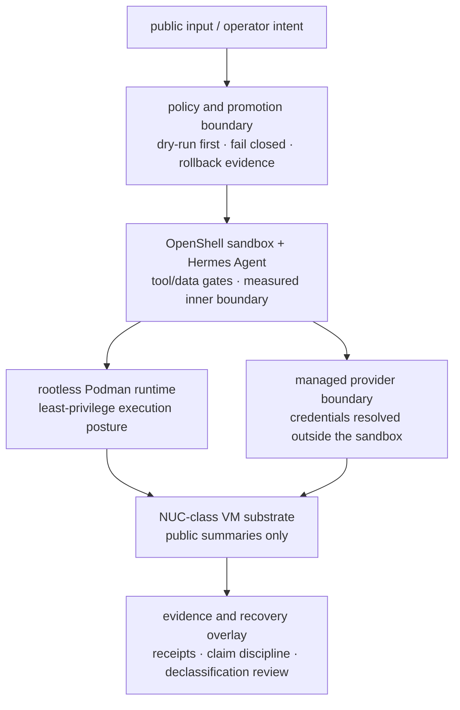

# BoundaryKit

> **BoundaryKit** (formerly **agent-vm**) is a public security case study for governing untrusted
> AI-agent workloads with explicit policy boundaries, rootless runtime isolation, provider-boundary
> controls, rollback discipline, and evidence-backed validation.
>
> The project repository and public site remain hosted at `sambegui/agent-vm` and
> `agent-vm.sabe.dev`.

**A public, static case study for running an untrusted agent workload inside a governed
sandbox without publishing private topology.**

BoundaryKit Agent VM demonstrates the control pattern around a current public-safe architecture:
operator intent moves through a policy/promotion boundary into an OpenShell sandbox running a Hermes
Agent workload, with rootless Podman runtime posture, a managed provider/inference boundary,
NUC-class VM substrate, and public evidence receipts.

The project gives credit where it is due: NVIDIA OpenShell is the sandbox boundary, Hermes Agent is
the agent workload, rootless Podman keeps the runtime away from a privileged Docker daemon, and
NUC-class hardware shows the pattern on modest local infrastructure. NVIDIA NemoClaw is credited as
blueprint/control-lineage material, not as the live public runtime stage.

## What This Public Repo Is

- A public architecture narrative for treating agent workloads as untrusted.
- A static site for `agent-vm.sabe.dev`.
- Sanitized public evidence summaries for specific measured boundaries.
- A reference acceptance suite that demonstrates older/generic substrate ideas with fictional values.
- Public safety and documentation checks for keeping private deployment details out of the repo.

## What It Is Not

- Not a managed platform or hosted service.
- Not a live deployment map.
- Not proof that every private or future workload is production-ready.
- Not a copy of private runbooks, receipts, host topology, SSH paths, VM names, NAS paths, tokens, or
  incident details.

Public examples use fictional placeholders such as `agent-platform`, `demo-client`,
`demo-registry.example`, `secret://demo/...`, `10.0.0.60`, `0000000`, and all-zero digests.

## Current Public Architecture



The diagram is a reference model, not live topology. It intentionally omits hostnames, IP addresses,
VM names, ports, routes, service names, key names, mount paths, incidents, and recovery paths.

## Evidence Status

| Area | Public status | Notes |
|---|---|---|
| Current sandbox runtime | boundary-measured | Public receipt #1 summarizes denied egress, SSRF, lateral movement, external DNS, read-only filesystem, and non-root checks for the inner sandbox boundary. |
| Managed inference boundary | boundary-measured | Public receipt #2 summarizes placeholder-in-sandbox credential handling and fail-closed behavior on the governed model path. |
| Rootless runtime posture | public architecture claim | The public case study favors rootless Podman and least-privilege runtime posture; private operational details stay private. |
| NUC-class substrate | public case-study context | The hardware class is intentionally generic and modest; no private host map is published. |
| Reference acceptance suite | lab/reference material | `platform/` keeps older generic VM, signed-image, and microVM acceptance fixtures as illustrative tests, not as the current public runtime story. |
| Production platform | not claimed | Production readiness requires workload-specific canary, auth, egress, audit, rollback, and SLO evidence. |

## 90-Second Tour

1. Start with [`docs/index.md`](docs/index.md) for the public reading order.
2. Read [`docs/architecture/00-overview.md`](docs/architecture/00-overview.md) for the current case-study
   architecture.
3. Read [`docs/evidence/governed-agent-workload-case-study.md`](docs/evidence/governed-agent-workload-case-study.md)
   for the current OpenShell/Hermes workload walkthrough.
4. Read [`docs/evidence/boundary-receipt-01-inner-sandbox.md`](docs/evidence/boundary-receipt-01-inner-sandbox.md)
   and [`docs/evidence/boundary-receipt-02-inference-boundary.md`](docs/evidence/boundary-receipt-02-inference-boundary.md)
   for the public measured boundaries.
5. Read [`docs/verification.md`](docs/verification.md) for the claim vocabulary.
6. Read [`docs/security-methodology.md`](docs/security-methodology.md), [`docs/threat-model.md`](docs/threat-model.md),
   and [`SECURITY.md`](SECURITY.md) for the public-safe security posture.
7. Treat [`platform/`](platform/) as a reference acceptance suite, not as the current live deployment design.

## Repository Map

| Path | What it is |
|---|---|
| `site/` | Static public site for `agent-vm.sabe.dev`. |
| `docs/index.md` | Public documentation index and reading order. |
| `docs/architecture/00-overview.md` | Current public case-study architecture. |
| `docs/architecture/01-isolation-substrate.md` | Reference acceptance-suite substrate, retained as illustrative lab material. |
| `docs/architecture/02-promotion-control-plane.md` | Dry-run-first promotion and rollback discipline, described at public control-objective level. |
| `docs/architecture/03-gateway-runtime-layout.md` | Legacy gateway fixture, retained as reference acceptance-suite history. |
| `docs/architecture/04-production-governance.md` | Risk tiers, canaries, fail-closed tools, audit, rollback, and evidence gates. |
| `docs/evidence/` | Sanitized public evidence summaries and claim discipline. |
| `docs/operations/` | Public-safe operator orientation; host-dependent lab commands are explicitly illustrative. |
| `platform/` | Older/generic reference acceptance suite for VM, image, reconcile/align, and microVM checks. |
| `examples/` | Fictional manifests and policy examples. |
| `scripts/public-safety-scan` | Public safety scan for common leak classes. |

## Design Principles

- **Agents are untrusted workloads** - model output, tool arguments, external data, and retrieved
  content are treated as inputs that can be compromised or misdirected.
- **Policy before execution** - changes move through explicit gates, dry-run/review posture, and
  rollback expectations before stronger claims are made.
- **Rootless runtime posture** - the public case study avoids a privileged Docker daemon and favors
  rootless Podman for least-privilege execution.
- **Secrets by reference** - examples use references such as `secret://demo/...`; raw values do not
  belong in public docs, manifests, images, logs, or receipts.
- **Evidence over assertion** - each public claim names its evidence level and what it does not prove.
- **Public/private boundary first** - public docs are newly written with placeholders, never copied
  down from private topology or raw operational logs.

## Safety Checks

Before publishing a branch, run:

```bash
make ci
scripts/public-safety-scan
git diff --check
```

Then do a manual declassification review for raw IPs, host aliases, VM names, SSH key names, NAS paths,
messaging identifiers, provider tokens, private repo paths, and live incident details. The scanner is
necessary but not sufficient.

## Status And License

BoundaryKit is a public case study plus a reference acceptance suite. It is a demonstration of
security architecture and evidence discipline for AI-agent workloads, not a turnkey product. Licensed
under **MIT** (see `LICENSE`).
