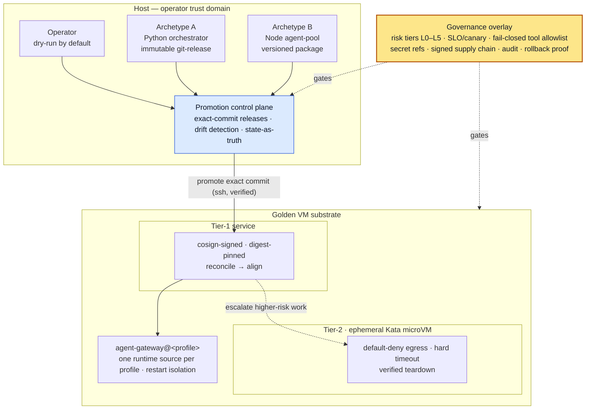

# agent-vm

**A validated walking skeleton for safe AI-agent automation infrastructure.**

`agent-vm` is a public proof-of-work project for the operational layer around tool-using AI agents:
isolation, dry-run promotion, rollback, audit evidence, and governance proportional to blast radius.
It starts from one premise: *an AI agent is an untrusted, tool-wielding workload.*

## Portfolio signal

This repository demonstrates how AI agents can be run as controlled operational workloads, not just
chat prompts or one-off scripts. It is relevant to AI automation, internal tools, platform
engineering, LLMOps, and workflow-governance work where agents can touch files, APIs, tickets,
messages, credentials, or production-like state.

## What this proves

- workload isolation for tool-using agents
- dry-run-first promotion and rollback workflows
- signed / digest-pinned deployment patterns
- runtime drift detection and state-as-truth checks
- tiered controls for higher-blast-radius execution
- human/operator governance around automation
- practical shell, Python, systemd, virtualization, and CI hygiene

## 90-second tour

1. Start with the architecture diagram below to see the control-plane/substrate boundary.
2. Read [`platform/state/substrate-validation.md`](platform/state/substrate-validation.md) for the
   run-backed substrate evidence.
3. Skim [`docs/operations/operator-quickstart.md`](docs/operations/operator-quickstart.md) for safe
   local checks versus host-dependent and mutating commands.
4. Review [`docs/verification.md`](docs/verification.md) and
   [`docs/evidence/substrate-validation-receipt.md`](docs/evidence/substrate-validation-receipt.md)
   for the evidence model.
5. Read [`SECURITY.md`](SECURITY.md) and [`docs/threat-model.md`](docs/threat-model.md) for trust
   boundaries, current gaps, and non-goals.

## Implementation status

| Area | Status | Notes |
|---|---|---|
| **Archetype A — immutable release** | exercised | Python orchestrator-style agent promoted by exact commit with dry-run/apply and rollback flow. |
| **Archetype B — package install** | captured/design | Node package-install workflows are documented with explicit stubs until package distribution and rollback mechanics are implemented. |
| **Tier-1 signed service** | host-validated | Local registry, cosign signature, digest-pinned manifest, reconcile/align flow. |
| **Tier-2 microVM sandbox** | host-validated | Kata/containerd job boots, default-deny egress is tested, timeout/teardown are verified. |
| **Production platform** | not claimed | This is a reference architecture and validated skeleton, not a turnkey managed platform. |

> **Reference architecture.** Every host, address, account, and identifier here is illustrative
> (`10.0.0.0/24`, `platform-host`, `agent-runtime`). Nothing points at real infrastructure, and no
> secrets are present — secret *references* only.

## Architecture at a glance



*Vertical flow is the trust boundary (operator → control plane → substrate). **Solid** = verified promotion flow; **dotted** = governance/policy & risk escalation; the highlighted node is the cross-cutting governance overlay.*

## Why this matters

AI agents are an awkward new workload class: they execute tool calls, hold credentials, reach
networks and other agents, and can be *steered by untrusted input* (prompt injection, tool poisoning,
excessive agency). Running several safely on shared infrastructure needs more than `docker run`. This
platform applies established production discipline — Google SRE (SLOs, error budgets, canaries), AWS
Well-Architected, supply-chain integrity (Sigstore/cosign, SLSA), MCP / OWASP-LLM tool-security, and
NIST AI RMF governance — sized for a single host instead of a hyperscaler.

## The three layers

```
   operator (host)        ┌────────────────────────────────────────────────┐
   dry-run by default ───►│  PROMOTION CONTROL PLANE                       │
                          │  immutable releases · drift detection ·        │
                          │  state-as-truth · 2 deployment models          │
                          └───────────────┬────────────────────────────────┘
                                          │ promote exact commit (ssh, verified)
                          ┌───────────────▼────────────────────────────────┐
                          │  ISOLATION SUBSTRATE  (golden VM, as code)     │
                          │  Tier-1 long-running service                   │
                          │    cosign-signed · digest-pinned · reconciled  │
                          │  Tier-2 ephemeral microVM sandbox (Kata)       │
                          │    default-deny egress · timeout · teardown    │
                          └───────────────┬────────────────────────────────┘
                                          │ per-profile, isolated
                          ┌───────────────▼────────────────────────────────┐
                          │  GATEWAY RUNTIME LAYOUT                        │
                          │  agent-gateway@<profile> · one runtime source  │
                          │  per profile · restart isolation               │
                          └────────────────────────────────────────────────┘
   governance overlay:  risk tiers L0–L5 · SLO/canary · MCP tool allowlist (fail-closed)
                        · secrets-by-reference · signed supply chain · audit · rollback proof
```

1. **Isolation substrate** — a nested-virt golden VM defined as code, hosting tiered workloads:
   **Tier-1** long-running services (cosign-**signed**, **digest-pinned**, reconciled to a manifest)
   and **Tier-2** ephemeral **microVM sandboxes** (Kata + containerd, **default-deny egress**, hard
   timeout, verified teardown). → [`docs/architecture/01-isolation-substrate.md`](docs/architecture/01-isolation-substrate.md), [`platform/`](platform/)
2. **Promotion control plane** — immutable, exact-commit releases shipped with provenance; mutations
   are **dry-run by default**; status tools **re-derive live truth and flag drift**. Exercised for
   the immutable-release archetype and captured for the package-install archetype. → [`docs/architecture/02-promotion-control-plane.md`](docs/architecture/02-promotion-control-plane.md), [`control-plane/`](control-plane/)
3. **Gateway runtime layout** — one systemd **template** per agent runtime; each profile is an
   explicit, independently-restartable service with **exactly one** declared runtime source. →
   [`docs/architecture/03-gateway-runtime-layout.md`](docs/architecture/03-gateway-runtime-layout.md), [`deploy/agent-gateway/`](deploy/agent-gateway/)

A **production-governance** overlay sits across all three: workload risk tiers, SLO/canary delivery,
MCP tool-agency security, secrets-by-reference, signed artifacts, audit, and tested rollback. →
[`docs/architecture/04-production-governance.md`](docs/architecture/04-production-governance.md)

## What's been validated

A working "walking skeleton" exercises the substrate end-to-end: nested-KVM golden VM provisioned as
code; a Tier-1 signed, digest-pinned service with reconcile/align and proven promote+rollback; a
Tier-2 Kata microVM that boots, is denied egress by default, honors a hard timeout, and tears down;
acceptance suite green. See [`platform/`](platform/), [`docs/verification.md`](docs/verification.md),
and [`docs/evidence/substrate-validation-receipt.md`](docs/evidence/substrate-validation-receipt.md).

## Repository map

| Path | What it is |
|---|---|
| `docs/architecture/` | The design, layer by layer (agnostic). Start at `00-overview.md`. |
| `docs/reference-workloads/` | The two abstract agent archetypes (A immutable-release, B package-install). |
| `docs/decisions/` | Architecture decision records. |
| `docs/operations/` | Operator quickstart and safe runbook entry points. |
| `docs/evidence/` | Sanitized validation receipts and evidence packets. |
| `docs/verification.md` | Claim discipline and verification gates. |
| `docs/threat-model.md` | Threat model, trust boundaries, and current limitations. |
| `SECURITY.md` | Public security policy and reporting guidance. |
| `platform/` | The substrate as code: VM provisioning, signed image pipeline, reconcile/align, sandbox runner, acceptance. |
| `control-plane/` | Promotion / status / rollback scripts — **dry-run by default**, `--apply` to act. |
| `deploy/agent-gateway/` | The templated multi-profile gateway (unit + launcher + example envs). |
| `examples/` | Illustrative manifests and state-as-truth files (not live). |

## Design principles

- **Agent-agnostic** — agents are workloads, not the architecture.
- **Immutable & verifiable** — exact commits, signed digests, deploy-time verification, no editing live.
- **Dry-run by default** — every mutation previews before it acts; `--apply` is explicit.
- **Least authority, fail-closed** — default-deny egress, explicit tool allowlists, refuse to serve on policy-load failure.
- **Evidence over assertion** — status re-derives ground truth; deploys carry provenance; rollback is proven, not assumed.

## Status & license

Reference architecture plus a validated substrate skeleton — a demonstration of secure multi-agent
platform design, not a turnkey product. Licensed under **MIT** (see `LICENSE`).
