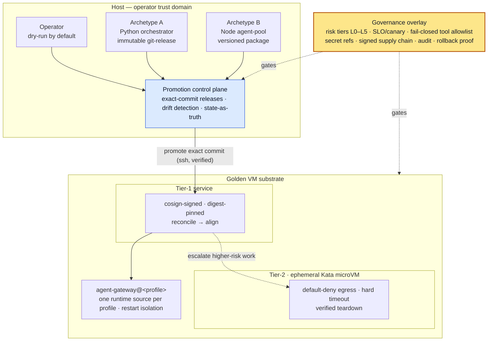

# agent-vm

**A secure, governed substrate for hosting persistent AI 'Agent Employees' as trusted collaborators.**

`agent-vm` is a secure reference architecture and platform skeleton designed to transition AI agents from isolated, context-blind chatbot tabs into governed, persistent team collaborators (the 'Agent Employee' archetype) that live inside group chats (Slack, Discord, ClickUp) alongside human employees. It enforces strict runtime isolation, exact-commit promotion, audit logging, and default-deny egress.

It models a high-efficiency team substrate where employees delegate repeatable workflows to agent employees, which are executed securely on a private VM.

## Portfolio signal

This repository demonstrates how AI agents can be run as governed, persistent digital employees rather than loose chat interfaces. It is directly relevant to enterprise AI automation, workspace collaboration, platform engineering, and IT governance where agents must securely access on-disk files, join meeting calls to compliantly extract transcripts, and generate highly-polished, brand-conforming assets (Excel, PowerPoints) directly back to the team.

## What this proves

- workload isolation for tool-using agents
- dry-run-first promotion and rollback workflows
- signed / digest-pinned deployment patterns
- runtime drift detection and state-as-truth checks
- tiered controls for higher-blast-radius execution
- human/operator governance around automation
- practical shell, Python, systemd, virtualization, and CI hygiene

## 90-second tour

1. Start with the architecture diagram below to see the control-plane/substrate boundary.
2. Read [`platform/state/substrate-validation.md`](platform/state/substrate-validation.md) for the
   run-backed substrate evidence.
3. Skim [`docs/operations/operator-quickstart.md`](docs/operations/operator-quickstart.md) for safe
   local checks versus host-dependent and mutating commands.
4. Review [`docs/verification.md`](docs/verification.md) and
   [`docs/evidence/substrate-validation-receipt.md`](docs/evidence/substrate-validation-receipt.md)
   for the evidence model.
5. Read [`docs/security-methodology.md`](docs/security-methodology.md), [`SECURITY.md`](SECURITY.md),
   and [`docs/threat-model.md`](docs/threat-model.md) for methodology, trust boundaries, current gaps,
   and non-goals.

## Implementation status

| Area | Status | Notes |
|---|---|---|
| **Archetype A — immutable release** | exercised | Python orchestrator-style agent promoted by exact commit with dry-run/apply and rollback flow. |
| **Archetype B — package install** | captured/design | Node package-install workflows are documented with explicit stubs until package distribution and rollback mechanics are implemented. |
| **Tier-1 signed service** | host-validated | Local registry, cosign signature, digest-pinned manifest, reconcile/align flow. |
| **Tier-2 microVM sandbox** | host-validated | Kata/containerd job boots, default-deny egress is tested, timeout/teardown are verified. |
| **Production platform** | not claimed | This is a reference architecture and validated skeleton, not a turnkey managed platform. |

> **Reference architecture.** Every host, network, account, and identifier here is illustrative
> (`example-network`, `platform-host`, `agent-runtime`). Nothing points at real infrastructure, and
> no secrets are present — secret *references* only.

## Architecture at a glance



*Vertical flow is the trust boundary (operator → control plane → substrate). **Solid** = verified promotion flow; **dotted** = governance/policy & risk escalation; the highlighted node is the cross-cutting governance overlay.*

## Why this matters

Most organizations use AI via isolated browser tabs (like ChatGPT or Claude). This model lacks team visibility, fragments context, and relies on manual copying and pasting. Moving to a persistent **Agent Employee** model—where agents live inside team channels (Slack, Discord) to collaborate alongside humans—is far more powerful, but introduces major security risks. 

AI agents execute tool calls, hold credentials, reach local file shares, and can be *steered by untrusted input* (prompt injection). This platform solves these concerns by providing:

1. **Persistent Unified Context:** The agent employee can securely access team files on-disk in the VM, allowing it to produce highly-polished, brand-compliant deliverables (Excel sheets, PowerPoint decks) directly back to Slack or ClickUp.
2. **Compliant Meeting Extraction:** The agent can safely join meeting calls (Google Meet/Zoom) to gather transcripts and compliantly extract action items and structured reports.
3. **Repeatable Workflow Skills:** Human team members assign repeatable workflows (or skills) to the agent in group chats, which are executed inside the secure, default-deny virtual machine.
4. **Extreme Cost Savings:** Automated execution of multi-step processes on isolated, predictable VM environments dramatically cuts down engineering overhead and manual task execution.

Running several agent employees safely on shared infrastructure is aligned with common security practices used by mature infrastructure teams: SLOs and canaries, explicit release promotion, supply-chain integrity, tool allowlists, egress controls, evidence-backed rollback, and governance proportional to blast radius.

## Security methodology

`agent-vm` is not a company-endorsed deployment pattern or a vendor certification. It is a public,
vendor-neutral reference architecture for applying practical infrastructure security to AI-agent
workloads:

- **Defense in depth** — runtime, network, release, and operator-workflow controls reinforce each
  other instead of relying on prompts or one sandbox.
- **Least privilege, fail closed** — agents receive only the tools, permissions, files, and network
  paths needed for their role; missing policy denies access rather than falling back to broad defaults.
- **Isolated, immutable runtime state** — long-running services run from promoted releases; release
  symlinks or equivalent targets are deployment pointers, not edit locations.
- **Egress and exfiltration resistance** — outbound access is mediated through allowlists or narrow
  policy gates, and sensitive data is passed by reference instead of copied into prompts, logs, browser
  pages, or generated artifacts.
- **Temporary preview access** — demos and review paths should be explicit, time-bounded, narrow, and
  easy to revoke; broad routing or persistent remote identities are avoided unless specifically needed.
  See the [secure gated agent preview access](docs/architecture/05-secure-gated-agent-preview-access.md)
  reference pattern.
- **Auditability and rollback** — runtime state, process command, import/source path, promoted commit,
  and rollback target are verifiable before claiming what is running.
- **Governance overlay** — risk tiers, canary checks, tool allowlists, signed or digest-pinned supply
  chain artifacts, audit trails, rollback proof, and secret-by-reference practices sit across the
  architecture.

See [`docs/security-methodology.md`](docs/security-methodology.md) for the public-safe methodology.

## The three layers

```
   operator (host)        ┌────────────────────────────────────────────────┐
   dry-run by default ───►│  PROMOTION CONTROL PLANE                       │
                          │  immutable releases · drift detection ·        │
                          │  state-as-truth · 2 deployment models          │
                          └───────────────┬────────────────────────────────┘
                                          │ promote exact commit (ssh, verified)
                          ┌───────────────▼────────────────────────────────┐
                          │  ISOLATION SUBSTRATE  (golden VM, as code)     │
                          │  Tier-1 long-running service                   │
                          │    cosign-signed · digest-pinned · reconciled  │
                          │  Tier-2 ephemeral microVM sandbox (Kata)       │
                          │    default-deny egress · timeout · teardown    │
                          └───────────────┬────────────────────────────────┘
                                          │ per-profile, isolated
                          ┌───────────────▼────────────────────────────────┐
                          │  GATEWAY RUNTIME LAYOUT                        │
                          │  agent-gateway@<profile> · one runtime source  │
                          │  per profile · restart isolation               │
                          └────────────────────────────────────────────────┘
   governance overlay:  risk tiers L0–L5 · SLO/canary · MCP tool allowlist (fail-closed)
                        · secrets-by-reference · signed supply chain · audit · rollback proof
```

1. **Isolation substrate** — a nested-virt golden VM defined as code, hosting tiered workloads:
   **Tier-1** long-running services (cosign-**signed**, **digest-pinned**, reconciled to a manifest)
   and **Tier-2** ephemeral **microVM sandboxes** (Kata + containerd, **default-deny egress**, hard
   timeout, verified teardown). → [`docs/architecture/01-isolation-substrate.md`](docs/architecture/01-isolation-substrate.md), [`platform/`](platform/)
2. **Promotion control plane** — immutable, exact-commit releases shipped with provenance; mutations
   are **dry-run by default**; status tools **re-derive live truth and flag drift**. Exercised for
   the immutable-release archetype and captured for the package-install archetype. → [`docs/architecture/02-promotion-control-plane.md`](docs/architecture/02-promotion-control-plane.md), [`control-plane/`](control-plane/)
3. **Gateway runtime layout** — one systemd **template** per agent runtime; each profile is an
   explicit, independently-restartable service with **exactly one** declared runtime source. →
   [`docs/architecture/03-gateway-runtime-layout.md`](docs/architecture/03-gateway-runtime-layout.md), [`deploy/agent-gateway/`](deploy/agent-gateway/)

A **production-governance** overlay sits across all three: workload risk tiers, SLO/canary delivery,
MCP tool-agency security, secrets-by-reference, signed artifacts, audit, and tested rollback. →
[`docs/architecture/04-production-governance.md`](docs/architecture/04-production-governance.md)

The same governance posture applies to previews: agent/dev preview services should sit behind a
temporary, revocable, least-privilege, auditable access gate rather than a public or standing tunnel.
→ [`docs/architecture/05-secure-gated-agent-preview-access.md`](docs/architecture/05-secure-gated-agent-preview-access.md)

## What's been validated

A working "walking skeleton" exercises the substrate end-to-end: nested-KVM golden VM provisioned as
code; a Tier-1 signed, digest-pinned service with reconcile/align and proven promote+rollback; a
Tier-2 Kata microVM that boots, is denied egress by default, honors a hard timeout, and tears down;
acceptance suite green. See [`platform/`](platform/), [`docs/verification.md`](docs/verification.md),
and [`docs/evidence/substrate-validation-receipt.md`](docs/evidence/substrate-validation-receipt.md).

## Repository map

| Path | What it is |
|---|---|
| `docs/architecture/` | The design, layer by layer (agnostic). Start at `00-overview.md`. |
| `docs/reference-workloads/` | The two abstract agent archetypes (A immutable-release, B package-install). |
| `docs/decisions/` | Architecture decision records. |
| `docs/operations/` | Operator quickstart and safe runbook entry points. |
| `docs/evidence/` | Sanitized validation receipts and evidence packets. |
| `docs/security-methodology.md` | Public-safe security methodology and operating principles. |
| `docs/architecture/05-secure-gated-agent-preview-access.md` | Reference pattern for temporary, revocable, least-privilege preview access. |
| `docs/verification.md` | Claim discipline and verification gates. |
| `docs/threat-model.md` | Threat model, trust boundaries, and current limitations. |
| `SECURITY.md` | Public security policy and reporting guidance. |
| `platform/` | The substrate as code: VM provisioning, signed image pipeline, reconcile/align, sandbox runner, acceptance. |
| `control-plane/` | Promotion / status / rollback scripts — **dry-run by default**, `--apply` to act. |
| `deploy/agent-gateway/` | The templated multi-profile gateway (unit + launcher + example envs). |
| `examples/` | Illustrative manifests and state-as-truth files (not live). |

## Design principles

- **Agent-agnostic** — agents are workloads, not the architecture.
- **Immutable & verifiable** — exact commits, signed digests, deploy-time verification, no editing live.
- **Dry-run by default** — every mutation previews before it acts; `--apply` is explicit.
- **Least authority, fail-closed** — default-deny egress, explicit tool allowlists, refuse to serve on policy-load failure.
- **Evidence over assertion** — status re-derives ground truth; deploys carry provenance; rollback is proven, not assumed.

## Status & license

Reference architecture plus a validated substrate skeleton — a demonstration of secure multi-agent
platform design, not a turnkey product. Licensed under **MIT** (see `LICENSE`).
