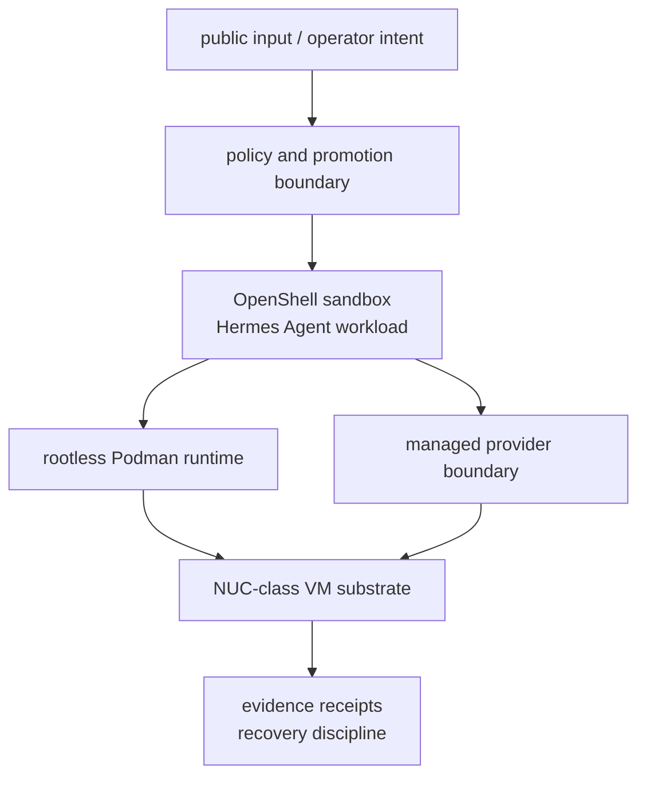

# 00 - Architecture overview

## From agent execution to governed sandboxing

Autonomous AI-agent workloads are probabilistic actors. They can be misdirected by untrusted input,
tool descriptions, retrieved documents, package behavior, model output, or operator workflow. The
architecture therefore does not treat the agent as trusted just because it is useful.

`BoundaryKit` presents a public case study for governing one such workload behind explicit trust
boundaries. The public story is intentionally sanitized: it preserves the architecture, claim
discipline, and evidence shape without publishing private hostnames, IP addresses, VM names, routes,
ports, key names, NAS paths, service names, incident details, or recovery paths.

## Current public shape

The current public architecture is:

| Layer | Assumes | Provides |
|---|---|---|
| **Public input / operator intent** | external messages, files, and prompts can misdirect the agent | the request is treated as untrusted until it passes policy |
| **Policy and promotion boundary** | operators can make mistakes and live state can drift | dry-run/review posture, fail-closed defaults, rollback expectations, state-as-truth checks |
| **OpenShell sandbox + Hermes Agent** | the agent process or its tools can be compromised | isolated execution boundary with tool/data gates and public boundary receipts |
| **Rootless Podman runtime** | a privileged container daemon increases blast radius | least-privilege runtime posture without relying on a rootful Docker socket |
| **Managed provider boundary** | model/tool credentials must not land in the sandbox | placeholder-in-sandbox configuration, provider credentials resolved outside the sandbox, fail-closed misroutes |
| **NUC-class VM substrate** | the sandbox boundary should not be the only line of defense | modest hardware backstop and public summaries without live topology |
| **Evidence and recovery overlay** | claims drift unless they are tested and recorded | sanitized receipts, non-claims, rollback expectations, and declassification review |

NVIDIA OpenShell is credited for the sandbox boundary, Hermes Agent for the agent workload, rootless
Podman for the least-privilege runtime posture, and NUC-class hardware for the modest local substrate.
NVIDIA NemoClaw is credited as blueprint/control-lineage material where relevant; it should not be
read as a separate live runtime stage in the public diagram.

## What is measured today

The current public evidence centers two measured boundaries:

1. [Boundary receipt #1 - inner sandbox](../evidence/boundary-receipt-01-inner-sandbox.md) summarizes
   egress refusal, SSRF refusal, lateral movement refusal, external DNS refusal, read-only filesystem
   behavior, and non-root execution checks.
2. [Boundary receipt #2 - inference boundary](../evidence/boundary-receipt-02-inference-boundary.md)
   summarizes placeholder-in-sandbox credential handling and fail-closed behavior on the governed
   model path.

These receipts prove only the named boundary behavior they describe. They do not prove every outer
containment layer, every future workload, or production readiness.

## Reference acceptance suite

The repository also retains an older/generic reference acceptance suite in `platform/` and selected
architecture pages. That suite demonstrates portable ideas such as a fictional golden VM, signed or
digest-pinned artifacts, reconcile/align checks, and microVM-style higher-risk job isolation.

Those pages are useful as lab fixtures, but they are not the primary public architecture for the
current Agent VM case study:

1. `01-isolation-substrate.md` - reference acceptance substrate.
2. `03-gateway-runtime-layout.md` - legacy per-profile gateway fixture.
3. `../evidence/substrate-validation-receipt.md` - sanitized receipt for that reference suite.

When the current case study and the reference acceptance suite differ, the current public case-study
language wins for `agent-vm.sabe.dev`.

## How to read this directory

1. Read this overview for the current public architecture.
2. Read `../verification.md` for claim levels and non-claims.
3. Read the two boundary receipts for measured public behavior.
4. Read `02-promotion-control-plane.md` and `04-production-governance.md` for control objectives.
5. Treat `01-isolation-substrate.md` and `03-gateway-runtime-layout.md` as reference acceptance
   fixtures unless a page explicitly says otherwise.
