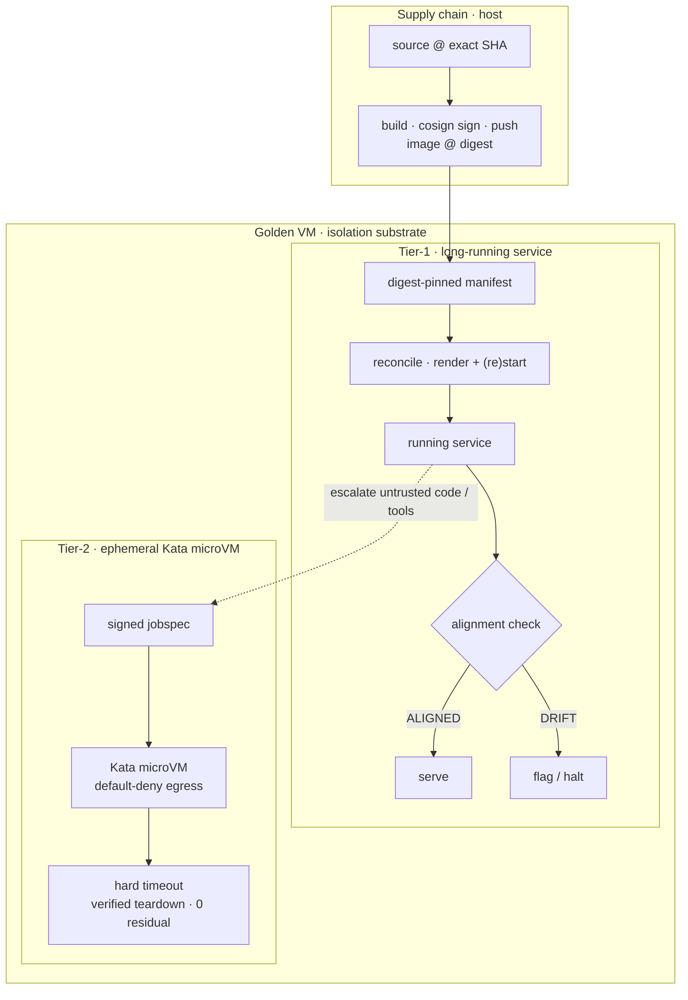

# 01 — Isolation substrate

The substrate is a **golden VM (`agent-platform`) defined as code** on a nested-virtualization host.
Agents never run on the host directly; the VM is the first boundary, and inside it workloads are
split into tiers by blast radius.



*Solid = verified pipeline; dotted = risk escalation into the microVM boundary.*

## Workload tiers

| Tier | Workload | Boundary | Controls |
|---|---|---|---|
| **Tier-0** | lab / synthetic | process | digest pinning, teardown, no secrets, local logs |
| **Tier-1** | long-running service | container, reconciled | cosign-signed + **digest-pinned** image, manifest-driven, health/readiness, alignment checks |
| **Tier-2** | ephemeral job | **microVM** (Kata) | **default-deny egress**, hard timeout, verified teardown, signed job image |

## Tier-1 — long-running services

A Tier-1 workload is described by a **manifest** that pins an image by **digest** (not tag). A small
**reconciler** renders a supervised unit from the manifest and (re)starts it; an **alignment** check
asserts the *running* image digest equals the *manifest* digest and that its signature verifies —
`ALIGNED` or `DRIFT`. Promotion and rollback are just manifest digest changes, re-reconciled.

```
platform/manifests/hello.service.yaml      # digest-pinned manifest (reference)
platform/control/reconcile <manifest>      # render + (re)start from the pinned digest
platform/control/align <manifest>          # running_digest == manifest_digest && signature verifies
```

This makes "what is actually running" a verifiable fact, not an assumption — the same idea the
control plane (`02`) applies to release symlinks.

## Tier-2 — ephemeral microVM sandbox

Untrusted or higher-risk jobs run in a **Kata microVM** via containerd — a real kernel boundary, not
a shared-kernel container. The runner enforces:

- **default-deny egress** (no network unless explicitly allowed; a blocked probe is evidence, not a silent pass),
- a **hard timeout**,
- **verified teardown** — it confirms zero residual container/process after the job.

```
platform/sandbox/sandbox-runner <jobspec.json>   # Kata microVM · default-deny · timeout · teardown
platform/sandbox/jobspec.example.json            # signed-by-digest job spec
```

## Supply chain

Images are built, **signed with cosign**, pushed to a local registry, and only ever referenced by
**digest**. Verification happens at **deploy time**, not just build time. This is the platform's
SLSA-flavored answer to "is this the artifact we approved?"

```
platform/images/build-sign-push <version>        # build → cosign sign → push → print digest
```

## Provisioned as code

```
platform/vm/provision-vm        # idempotent: create/customize the golden VM, wait for SSH
platform/vm/destroy-vm          # idempotent teardown
platform/validate/nested-smoke  # prove a HW-backed microVM boots (closes the nested-virt gate)
platform/validate/acceptance    # end-to-end: tier1 health · alignment · tier2 boot/egress-deny/teardown
```

The acceptance harness is the substrate's contract: if it is green, the isolation guarantees hold.
