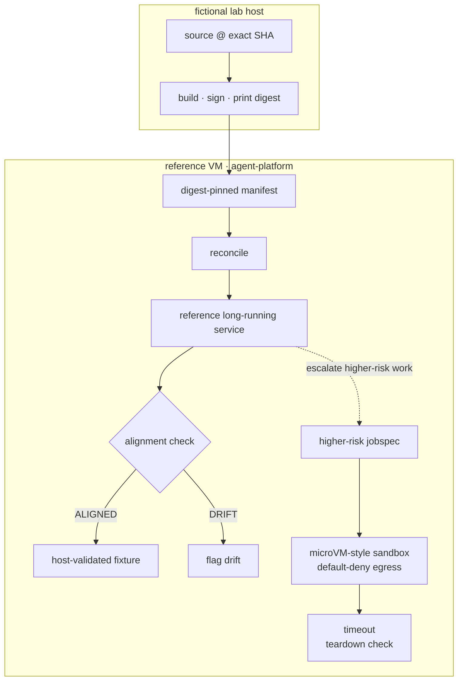

# 01 - Reference acceptance substrate

> **Status:** Reference acceptance-suite material. This page describes a generic lab fixture retained
> for portable validation ideas. It is not the current public runtime architecture for
> `agent-vm.sabe.dev`.

The current public case study is centered on an OpenShell sandbox running a Hermes Agent workload,
rootless Podman runtime posture, a managed provider boundary, a NUC-class VM substrate, and public
evidence receipts. This page preserves an older/generic acceptance substrate that can still be useful
for validating isolation concepts in a fictional lab.

## What this page is for

Use this page when you want to understand the reference acceptance suite under `platform/`:

- a fictional lab VM named `agent-platform`;
- signed or digest-pinned artifact examples;
- reconcile/align checks that compare declared state to running state;
- a higher-risk job fixture that demonstrates microVM-style default-deny egress and teardown checks.

Do not read it as live topology, current private deployment state, or proof that the current public
case study uses this exact runtime layout.

## Reference fixture shape



Solid arrows describe the reference acceptance path. Dotted arrows describe escalation from a
long-running fixture into a stronger isolation fixture.

## Reference checks

| Check | Purpose | Current public meaning |
|---|---|---|
| Digest-pinned manifest | Prove declared artifact identity is explicit. | Useful supply-chain pattern, not current live deployment evidence. |
| Reconcile/align | Compare running state against declared state. | Useful state-as-truth pattern, not a claim about private topology. |
| MicroVM-style job | Exercise stronger isolation for higher-risk work. | Reference acceptance fixture; current public receipts lead with OpenShell sandbox and provider-boundary measurements. |
| Default-deny egress | Verify denied outbound attempts in the fixture. | Same control objective as the current case study, but separate evidence. |
| Teardown check | Confirm no residual fixture runtime remains after the job. | Reference-lab hygiene check, not production readiness. |

## Commands

These commands are host-dependent lab commands. They are expected to fail on ordinary laptops or CI
without the required virtualization stack. They are not needed to read or validate the public static
site.

```bash
platform/vm/provision-vm
platform/validate/nested-smoke
platform/validate/acceptance
```

Inside the fictional lab VM, the reference suite uses:

```bash
platform/images/build-sign-push <version>
platform/control/reconcile platform/manifests/hello.service.yaml
platform/control/align platform/manifests/hello.service.yaml
platform/sandbox/sandbox-runner platform/sandbox/jobspec.example.json
```

## Non-claims

This page does not claim:

- that the public site exposes live deployment topology;
- that the current Agent VM case study uses this exact lab fixture;
- that every outer containment boundary is measured;
- that production readiness exists for a real workload;
- that any private credential, token, host, VM, registry, or incident detail is present.

For the current public evidence trail, start with
[`../evidence/boundary-receipt-01-inner-sandbox.md`](../evidence/boundary-receipt-01-inner-sandbox.md)
and
[`../evidence/boundary-receipt-02-inference-boundary.md`](../evidence/boundary-receipt-02-inference-boundary.md).
