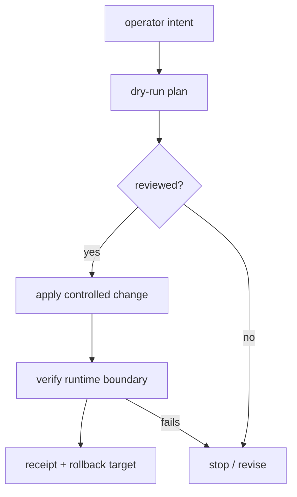

# 02 - Policy and promotion boundary

The promotion boundary is the public control pattern that sits between operator intent and agent
execution. It is not a live deployment runbook. Its job is to make mutation reviewable, reversible,
and tied to evidence before stronger claims are made.

## Control objectives

- **Dry-run first:** mutation tools print what they would change before any apply path exists.
- **Exact revision or artifact:** the promoted thing is named precisely by commit, version, digest, or
  equivalent immutable identifier.
- **Rollback target captured first:** the previous known-good target is recorded before a change is
  applied.
- **State re-derived:** status tools re-read current state instead of trusting the last deployment note.
- **Fail closed:** missing policy, unknown tools, broken provider routing, or failed verification stops
  the claim from advancing.

## Public case-study usage

In the current Agent VM story, the promotion boundary is expressed as:

- policy gates before an OpenShell/Hermes workload is treated as approved;
- rootless runtime posture and sandbox checks before stronger claims;
- managed provider routing that fails closed when misconfigured;
- public receipts that separate measured boundaries from pending boundaries;
- rollback/recovery expectations before production-readiness language.

The public docs intentionally avoid live hostnames, release paths, VM names, SSH aliases, key names,
service names, and incident-specific recovery details.

## Reference acceptance-suite usage

The older reference acceptance suite contains host-side scripts that demonstrate the same ideas with
fictional lab values. Those scripts are useful for static review and local lab experimentation, but
they are not evidence that a private deployment was validated.

Examples of public-safe concepts those scripts demonstrate:

| Concept | Public-safe meaning |
|---|---|
| `--apply` gate | default is review-only until a human chooses mutation |
| release identifier | a promoted artifact is named precisely |
| status check | current state is re-derived rather than assumed |
| rollback command | recovery is part of the promotion contract |

## Evidence expected before stronger claims

A promotion or policy-change receipt should name:

- the revision, version, digest, or policy identifier;
- the dry-run output reviewed before apply;
- the rollback target captured before apply;
- the post-change boundary checks;
- the non-claims and remaining pending boundaries.

Without that evidence, the public wording should stay at design or static-validation level.
