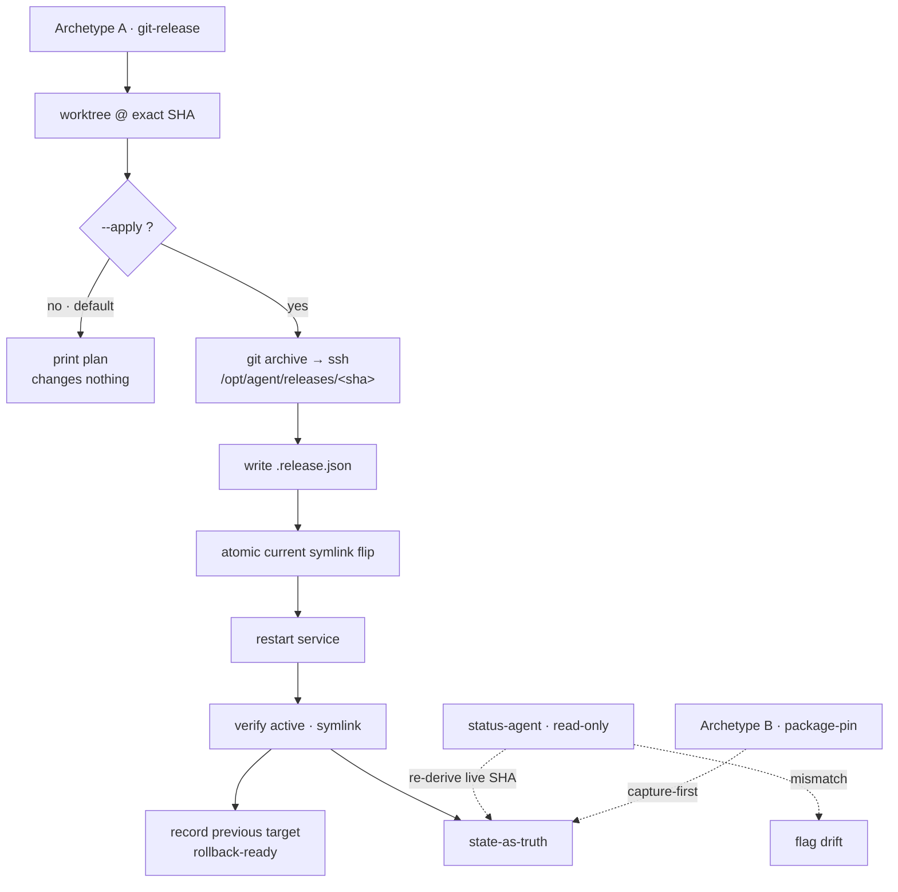

# 02 — Promotion control plane

The control plane is a **host-side** set of small, idempotent scripts plus versioned Markdown
"truth" files. It deploys agent runtimes **over ssh against immutable releases** — live services are
never run from a writable host mount, and live paths are never edited in place.



*Solid = verified promotion flow; dotted = read-only drift detection and capture-first archetype.*

## Immutable, exact-commit releases

Promotion ships an **exact commit**, not a working tree:

```
git archive <sha>  →  stream over ssh  →  unpack into /opt/agent/releases/<sha>-<label>
                   →  write <release>/.release.json  (sha, label, source, promoter, timestamp)
                   →  atomic `ln -sfn` flip of /opt/agent/current
                   →  restart the service  →  verify (active · symlink)
```

The `.release.json` provenance stamp means a release is **self-describing**. `status-agent` and
`agent-pr verify` re-read the release metadata/source path after promotion so the source SHA is a
fact you can check, not a guess. The previous `current` target is recorded as the **rollback target**
*before* the flip.

```
control-plane/promote-agent  --sha <sha> --label <l> --worktree <path> [--apply]
control-plane/rollback-agent --to <release-dirname|abs-path> [--apply]
```

## Dry-run by default

Promotion and rollback scripts preview their plan and change nothing unless `--apply` is passed. The
exact commit, release path, symlink, and service they will touch are printed first. Platform
lifecycle/bootstrap/reconcile commands are lab-host operations and should be reviewed with their
printed context or `--print-config` path before use.

## Drift detection (state-as-truth, re-derived)

`state/*.md` records the durable truth (topology, runtimes, releases). But a live symlink can be
re-pointed by another actor, so status tools **re-derive ground truth on demand and flag drift**
rather than trusting the recorded value:

```
control-plane/status-agent           # live symlink → release, source SHA (3-tier), service state, drift vs state/
control-plane/status-agent --update  # rewrite the host-local truth markers (never the runtime)
control-plane/smoke-agent            # read-only post-promote sanity checks
```

Source-SHA resolution is **3-tier**: `<release>/.release.json` → in-release `git rev-parse` → recover
from the `<sha>-<label>` directory name — so truth survives releases built by other tooling.

## Two deployment models = the agnosticism proof

The same control-plane discipline wraps **two deliberately different** runtimes:

| | Archetype A (immutable release) | Archetype B (package install) |
|---|---|---|
| Source | git commit | package version |
| Ship | `git archive` → release dir | install pinned version |
| Select | `current` symlink flip | binary/symlink version pin |
| Scripts | `promote-agent` / `rollback-agent` | `promote-pkg` / `rollback-pkg` (capture-first) |

`promote-pkg`/`rollback-pkg` are intentional **documented stubs** until a package distribution is
confirmed — the platform captures and audits Archetype B before it automates it.

## Library

`control-plane/lib/common.sh` is sourced by every script: the ssh target, `guest_ssh`/`guest_sudo`
helpers, logging, the dry-run gate (`APPLY` + `applying`), and `print_context` (every script prints
exactly what it operates on).
