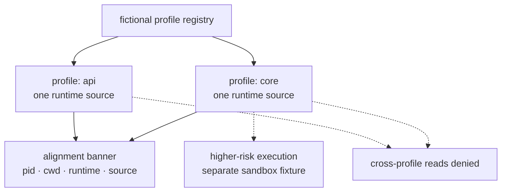

# 03 - Reference gateway runtime layout

> **Status:** Reference acceptance-suite material. This page describes a legacy/generic per-profile
> gateway fixture. It is not the current public runtime architecture for `agent-vm.sabe.dev`.

The current public case study centers an OpenShell sandbox running a Hermes Agent workload, rootless
Podman runtime posture, a managed provider boundary, a NUC-class VM substrate, and evidence receipts.
This page is retained because its design lessons are still useful: avoid ambiguous runtime sources,
avoid shared mutable profile state, and prove what is running before making claims.

## Why the fixture existed

The legacy fixture modeled several agent profiles served by one template:

- one declared runtime source per profile;
- independent restart boundaries;
- separate profile homes and logs;
- dry-run alignment proof before a smoke test;
- no broad central dashboard mutation.

Those are still good governance ideas. The current public case study expresses them through sandbox,
provider-boundary, and receipt language rather than through a public `agent-gateway@<profile>` runtime
map.

## Reference fixture shape

This diagram is a fictional reference fixture. It omits real service names, hostnames, ports, users,
paths, and deployment details.

## Lessons retained

| Lesson | Public-safe formulation |
|---|---|
| One runtime source | A workload should have one declared source of truth, not scattered environment overrides. |
| Independent lifecycle | Restarting or rolling back one profile/workload should not disturb unrelated profiles. |
| State isolation | Application-level state separation is not automatically a security boundary. |
| Alignment proof | Before a smoke test, re-derive what code/artifact is actually running. |
| Higher-risk work | Move untrusted or higher-blast-radius execution into a stronger boundary and record a receipt. |

## Relationship to the current case study

For `agent-vm.sabe.dev`, use these current terms first:

- **OpenShell sandbox + Hermes Agent** for the public runtime boundary.
- **Rootless Podman** for the least-privilege runtime posture.
- **Managed provider boundary** for model/tool-provider credential handling.
- **Evidence receipts** for measured behavior.

Only use this gateway fixture when discussing the reference acceptance suite or older portable design
lessons.

## Non-claims

This page does not claim:

- that `agent-gateway@<profile>` is the current public runtime stage;
- that public docs reveal private service units, users, home paths, or ports;
- that application profile separation is sufficient as a security boundary;
- that a reference fixture is production-ready.
