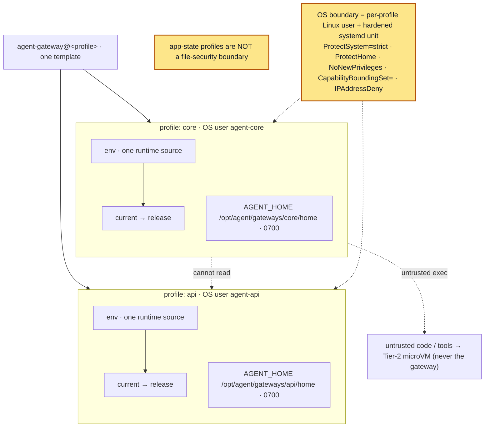

# 03 — Gateway runtime layout

A single agent runtime often serves several **profiles** at once (a primary channel gateway, an HTTP
API surface, an MCP/SSE endpoint, …). The failure this layer prevents: many profiles sharing one
mutable runtime symlink, each setting the runtime via *conflicting* `Environment=` lines spread across
a unit fragment and several drop-ins — so "which runtime is this profile importing, and did I restart
the right service?" becomes genuinely ambiguous.



*Solid = template instantiated per profile; dotted = the isolation boundaries (cross-profile read denial, OS hardening, untrusted-exec escalation).*

## One template, one runtime source per profile

```
/etc/systemd/system/agent-gateway@.service     # the template (deploy/agent-gateway/systemd/)
/opt/agent/_lib/launch                          # shared launcher (deploy/agent-gateway/_lib/launch)
/opt/agent/gateways/<profile>/
    current -> /opt/agent/releases/<sha>-<label>   # THIS profile's runtime — the single source of truth
    env                                            # EnvironmentFile: declares the runtime ONCE
    home/                                          # AGENT_HOME (config/state/.env)
    logs/
```

The runtime source (`AGENT_ROOT` / `PYTHONPATH`) is declared **exactly once**, in the profile's `env`,
pointing at that profile's **own** `current` symlink. The unit sets no `PYTHONPATH`, and **no drop-in
may**. A lint reduces to: `systemctl cat agent-gateway@<p>` shows zero `PYTHONPATH` (it comes from the
env file), and the running process shows exactly one.

## Per-profile isolation

- **Independent runtime version** — promoting a new build to one profile (e.g. a smoke profile) never
  touches the others. Each `current` symlink is flipped on its own.
- **Independent lifecycle** — the units carry no `Requires=`/`PartOf=`/`BindsTo=` on each other, so
  `systemctl restart agent-gateway@<p>` disturbs nothing else. Plugins are imported at process start,
  so a plugin change is picked up only by restarting *that* instance.
- **Unambiguous targets** — the profile is in the unit name; `agent-gateway` with no instance is not
  runnable, so an ambiguous "the gateway" can never be started by accident.

## Two entrypoint modes, one template

A shared launcher resolves the entrypoint from the profile env, prints an **alignment banner**
(`pid / cwd / PYTHONPATH / runtime / sha`), then `exec`s the real process:

- `AGENT_GATEWAY_MODE=cli` → `python -m agent_cli.main gateway run --replace` (standard CLI gateway).
- `AGENT_GATEWAY_MODE=script` → `python $AGENT_PROFILE_EXEC` (bespoke per-profile entrypoint).

## Isolation boundaries — three layers, not one

Per-profile *app-state* separation (each profile's own config / memory / sessions) is an
**application** convenience, **not** a security boundary: two profiles running under the **same OS
user** can still read each other's files. Production isolation therefore uses three distinct boundaries:

| Boundary | Mechanism | What it stops |
|---|---|---|
| App-state | per-profile home / config / sessions | accidental state mixing (not a security control) |
| **File / OS** | **one Linux user + one hardened systemd unit + one home per profile** | one profile reading another profile's files |
| **Execution** | Tier-2 microVM / Kata sandbox | untrusted tool/code escaping the long-lived gateway |

In **production-isolation mode** the template runs each profile as its **own service account**
(`User=agent-<profile>`) with systemd hardening — `ProtectSystem=strict`, `ProtectHome=yes`,
`PrivateTmp`, `NoNewPrivileges`, `CapabilityBoundingSet=` (drop all), `IPAddressDeny=any` + a
per-profile allowlist — writing only its own `home/` and `logs/` (`ReadWritePaths`). The runtime tree
(`current` → an immutable release) stays **read-only**. Untrusted code is never run in the gateway; it
is escalated to a **Tier-2 microVM**. See
[`agent-gateway@.service`](../../deploy/agent-gateway/systemd/agent-gateway@.service).

### Two modes

- **Convenience mode** — one OS user, one home, many app-state profiles, one dashboard switcher. Fine
  for dev / low-risk same-owner profiles; *not* a file-isolation boundary.
- **Production-isolation mode** *(recommended)* — one OS user + one hardened system service + one home
  per profile, a per-profile status endpoint, and a central **read-only** registry view.

A profile is only "isolated" once it is **proven** that cross-profile read is denied, denied tools are
absent, egress is default-denied, its dashboard sees only its own state, and it can be stopped/rolled
back without touching siblings.

## Alignment proof

Because the launcher banner and `/proc/<pid>/environ` expose the actual cwd, `PYTHONPATH`, runtime
path, and source SHA, you can *prove* a given profile is running the intended release before any live
smoke test — and prove sibling profiles were untouched. `AGENT_LAUNCH_DRYRUN=1` resolves the command
off-host without executing anything (see `deploy/agent-gateway/README.md`).

This is the same "verify, don't assume" stance as Tier-1 alignment (`01`) and control-plane drift
detection (`02`), applied to multi-profile service hosting.
