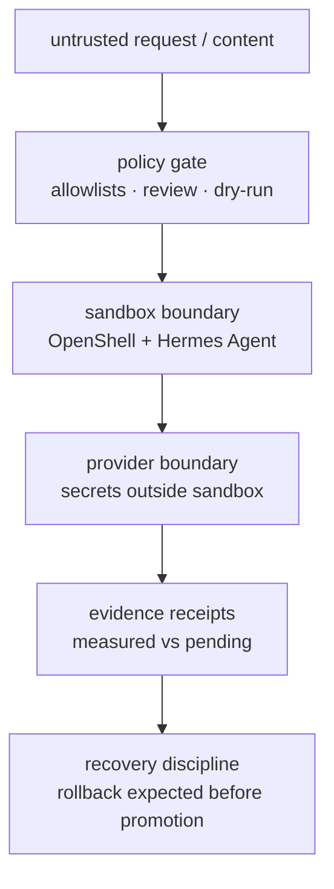

# 04 - Governance and claim discipline

Governance decides what an agent workload is allowed to do and what evidence is required before a
claim gets stronger. The current public case study does not claim a managed production platform; it
shows how policy, sandboxing, provider boundaries, receipts, and rollback expectations fit together.

## Risk tiers

| Tier | Example public description | Required public evidence before stronger claims |
|---|---|---|
| **L0 lab** | synthetic checks, no real secrets | static checks, fake values, teardown notes |
| **L1 bounded read-only** | reads approved inputs and returns summaries | auth denial, tool allowlist, default-deny egress, no raw secrets |
| **L2 limited action** | invokes approved tools with bounded effects | human approval for writes, scoped credentials, audit events, rollback drill |
| **L3 owner-facing** | affects a real owner workflow | canary packet, SLO comparison, recovery proof, incident loop |
| **L4 client-facing** | touches external/client data | tenant/data isolation, external-audit-ready evidence, stronger identity |
| **L5 regulated/sensitive** | high autonomy or regulated data | compliance review, retention policy, dedicated environment |

The public Agent VM material currently stays below production-ready claims. It can show measured
boundaries and architecture discipline without claiming that a real workload passed every canary gate.

## Current governance overlay

## Tool and data gates

For agents that expose tools, the tool surface is the attack surface:

- tools are an explicit allowlist;
- denied tools should be absent or fail closed;
- unknown tools fail closed;
- policy load failures stop serving rather than falling back to broad permissions;
- tool descriptions and schemas are treated as injection surfaces;
- sensitive writes require human approval and audit evidence.

## Secrets and provider boundaries

Public examples use secret references, not values. A useful public provider-boundary receipt should
show:

- the sandbox sees a placeholder or reference, not a raw provider credential;
- the provider path resolves outside the sandbox;
- a broken or misrouted provider path fails closed;
- logs, images, manifests, and receipts do not contain raw token material.

## Egress and exfiltration

Default-deny egress is a control objective, not a slogan. A public boundary receipt should name the
boundary under test and include denied crossing attempts such as:

- direct outbound network attempts;
- raw-socket or bypass attempts where relevant;
- SSRF-style metadata probes;
- lateral movement attempts;
- external DNS attempts;
- filesystem and privilege checks when those are in scope.

## Progressive evidence

Use these terms precisely:

| Term | Meaning |
|---|---|
| **Architecture narrative** | the design is explained; no runtime behavior is proven |
| **Static-validated** | public repo checks ran locally or in CI |
| **Reference-lab validated** | a fictional/generic lab fixture ran the acceptance suite |
| **Boundary-measured** | one named boundary refused a defined negative-test matrix |
| **Production-ready** | a real workload produced canary, auth, egress, audit, rollback, and SLO evidence |

## Public non-claims

The public docs must not imply:

- live deployment topology;
- customer deployment evidence;
- raw private logs or incident details;
- token values or token shapes;
- production readiness from unit creation alone;
- endorsement by upstream projects beyond public credit and links.

Governance is the discipline that keeps the public case study honest: if a boundary was not measured,
say it is pending; if a command was not run, say it was not run; if evidence is private, publish only a
newly written sanitized summary with fictional values.
