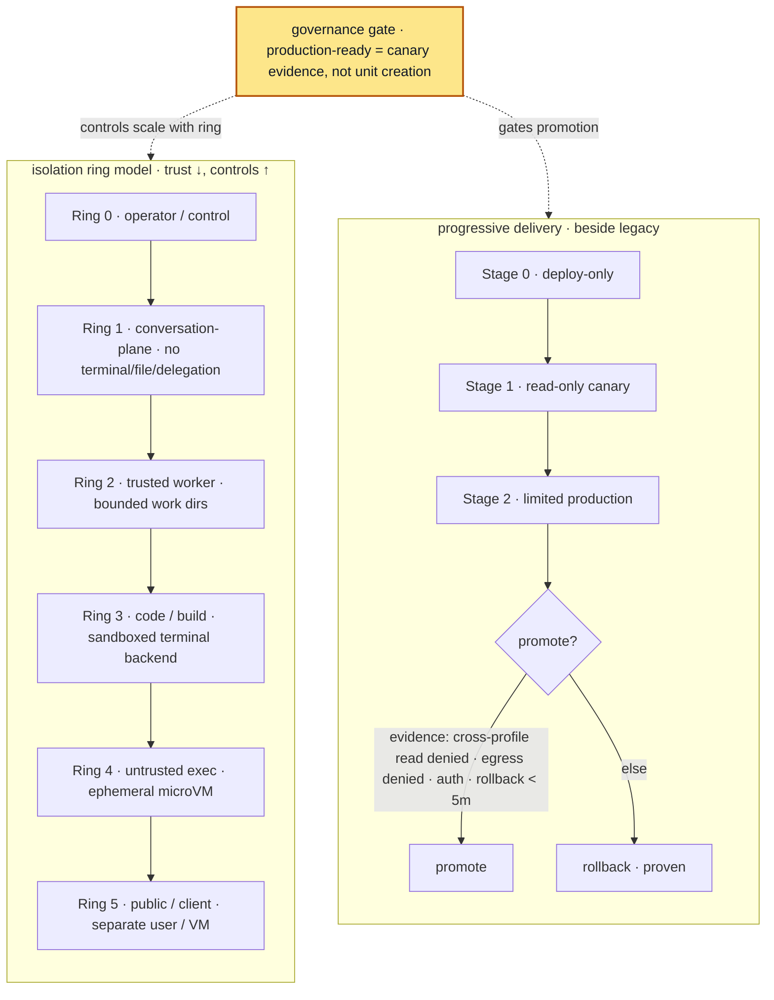

# 04 — Production governance

The substrate makes workloads *isolatable*; governance decides **what a given workload is allowed to
be**, and gates it from lab to production with controls proportional to its blast radius. The unit of
governance is a **production cell**: one workload, with a contract, a signed artifact, a manifest,
isolation, auth, observability, progressive delivery, and proven rollback.



*Solid = the trust ladder and canary progression; dotted = governance gating both.*

## Risk tiers (controls scale with autonomy/blast radius)

| Tier | Example | Required controls |
|---|---|---|
| **L0** Lab | synthetic job | digest pinning, teardown, no secrets, local logs |
| **L1** Internal read-only | read-only awareness endpoint | auth, **tool allowlist**, isolated state, **default-deny egress**, audit |
| **L2** Internal limited action | approved read/send tools | human approval for writes, stronger audit, tested rollback, scoped tokens |
| **L3** Owner-facing prod | a primary service | high SLO, full incident loop, backup/restore, live runtime proof |
| **L4** Client-facing | external surface | tenant isolation, data policy, external-audit-ready evidence, stronger identity |
| **L5** Regulated | high-autonomy/sensitive | compliance review, strict retention, dedicated environment |

A workload may not deploy with controls below its tier; raising autonomy raises the bar.

## Isolation ring model (profile classes)

Risk tiers say *how much control* a workload needs; isolation **rings** say *what boundary and file /
tool posture* a profile class gets. They complement each other.

| Ring | Class | Boundary | File access | Tool posture |
|---|---|---|---|---|
| 0 | operator / control | human-gated | observe registry & receipts; not all homes | owner-gated admin only |
| 1 | conversation-plane | dedicated user + hardened unit | own home only | no terminal / file / delegation |
| 2 | trusted worker | dedicated user + bounded dirs | own home + assigned worktree | limited tools by role |
| 3 | code / build | dedicated user + sandboxed terminal backend | assigned worktree only | terminal via container / microVM |
| 4 | untrusted exec | ephemeral microVM | scratch only | default-deny egress, teardown verified |
| 5 | public / client | separate user, preferably separate VM | client home only | no private memory / cross-client |

A read-only conversation-plane endpoint is **Ring 1**: dedicated OS user, own home only, no
terminal/file/delegation tools.

## Tool-agency security (the AI-specific danger surface)

For agents that expose tools (e.g. via MCP), the tool surface *is* the attack surface:

- tools are an **explicit allowlist**, not "whatever is convenient";
- **denied tools are absent from `tools/list`**, not merely rejected on call;
- an **unknown allowed tool fails closed**; a tool **schema-hash drift blocks** the workload;
- policy that cannot be loaded → **refuse to serve** (never fall back to a permissive default);
- tool *descriptions/schemas* are treated as injection surfaces; sensitive actions require approval.

```
examples/manifests/tool-policy.example.yaml   # allowed/denied tools + schema hashes + fail-closed flags
```

## Secrets, egress, supply chain

- **Secrets by reference only** — manifests carry `secret://…` refs; never values. No secret in image
  layers, manifests, logs, SBOM, or git. Token *ids/hashes* may be recorded; values never.
- **Default-deny egress** — internet, arbitrary DNS, work-plane APIs, model/messaging APIs all denied
  unless explicitly allowed; production gates should emit audit events for denied egress.
- **Signed supply chain** — exact source SHA → digest-pinned image → cosign signature → SBOM/provenance
  ref → explicit verification gates. Reconcile-time signature verification remains a hardening item.

## Secure gated preview access

Preview surfaces are governed exposure, not casual tunnels. A development or agent-preview service may
be opened only through a temporary, revocable, least-privilege, auditable gate with no broad routing,
no public exposure, no standing remote identity, and no secret values in prompts, logs, repositories,
or receipts. See [`05-secure-gated-agent-preview-access.md`](05-secure-gated-agent-preview-access.md)
for the reference pattern and sanitized Tailscale example.

## Progressive delivery (measured exposure, not blind cutover)

A workload is promoted through canary stages **beside** the existing one, never replacing it in one
motion:

```
Stage 0  deploy-only dry canary   — health, auth-deny, egress-deny, alignment, audit; no clients
Stage 1  read-only canary         — one trusted client, read calls only, observe
Stage 2  limited production canary — one/two clients, narrow approved actions, old service still live
Promotion decision                — only if SLO met, rollback proven, no tool/egress/secret surprises
```

SLO/error-budget thinking, synthetic probes with baseline/control comparison, and **rollback proven
before promotion** are required — and you do not claim stronger reliability than your probe volume
supports.

## Audit & rollback

Minimum audit events — `service.start/stop`, `auth.accepted/denied`, `tool.allowed/denied`,
`egress.denied`, `secret.loaded`, `alignment.checked`, `rollback.executed` — shipped **off-box**,
append-only, no secret values. **Rollback is a tested drill** (endpoint and manifest-digest), with a
recorded receipt, not an assumption.

This overlay is how a new agent crosses from "runs in the lab" to evidence-gated production use
without the platform having to trust the agent.

## Dashboards & control plane

A single dashboard that can edit every profile's home is a powerful cross-profile authority — it
collapses the isolation it sits above. The production pattern:

- **per-profile** dashboards / status endpoints, each bound to loopback or a private socket, reading
  only their own profile;
- a **central dashboard that is read-only by default** — a registry / observability view (profile
  name, ring, unit, health, canary state, rollback target, evidence path) with **no broad
  profile-home access**;
- any central mutation is an **explicit, approved, profile-scoped** admin action through a narrow
  helper that writes a receipt — never a broad filesystem mount.

The non-secret registry that drives it:
[`examples/manifests/profile-registry.example.yaml`](../../examples/manifests/profile-registry.example.yaml);
a per-profile capability contract:
[`examples/manifests/profile-capability.example.yaml`](../../examples/manifests/profile-capability.example.yaml).

## Production-ready means evidence, not unit creation

Creating users and units is not production. A workload is production-ready only when **recorded
evidence** shows it runs the intended code, **cross-profile read is denied**, denied tools are absent,
egress policy is enforced, secrets are not logged, **rollback works**, and the canary survived real
traffic. The scaffold and first canary can land the same day; the *production claim* waits for the
evidence packet.
